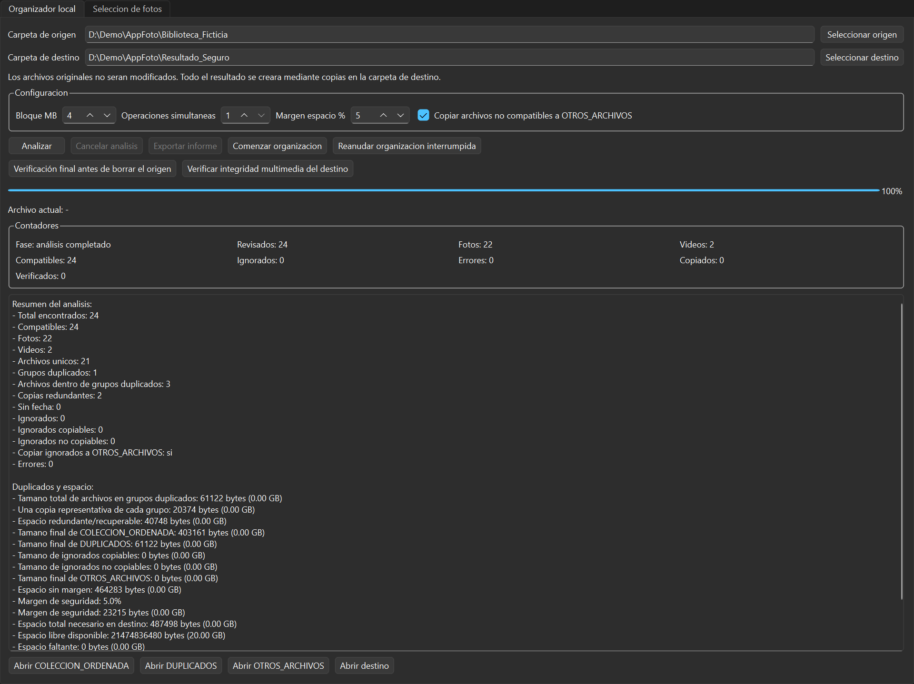
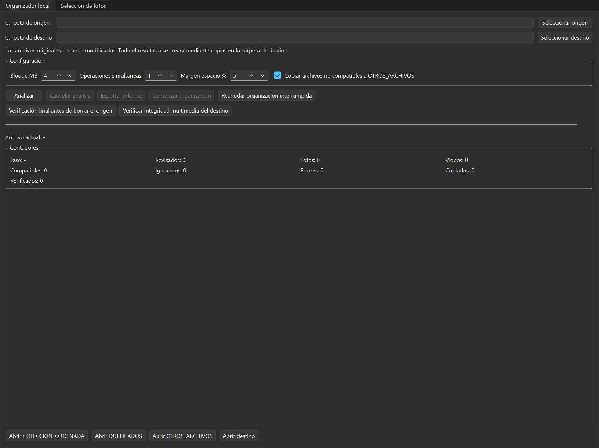
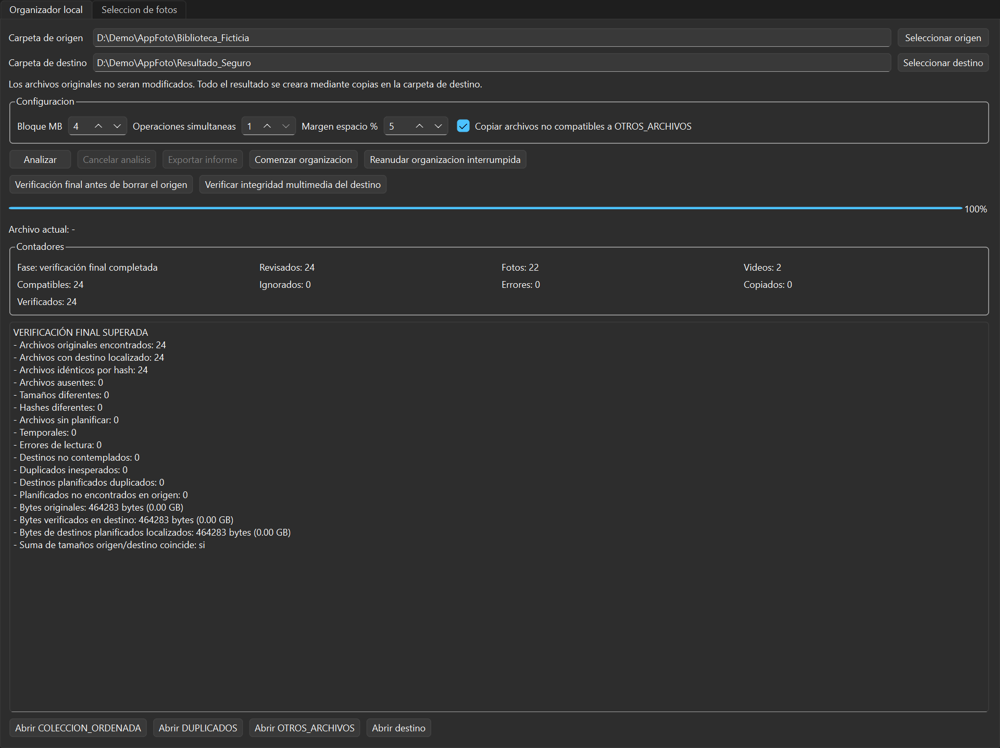
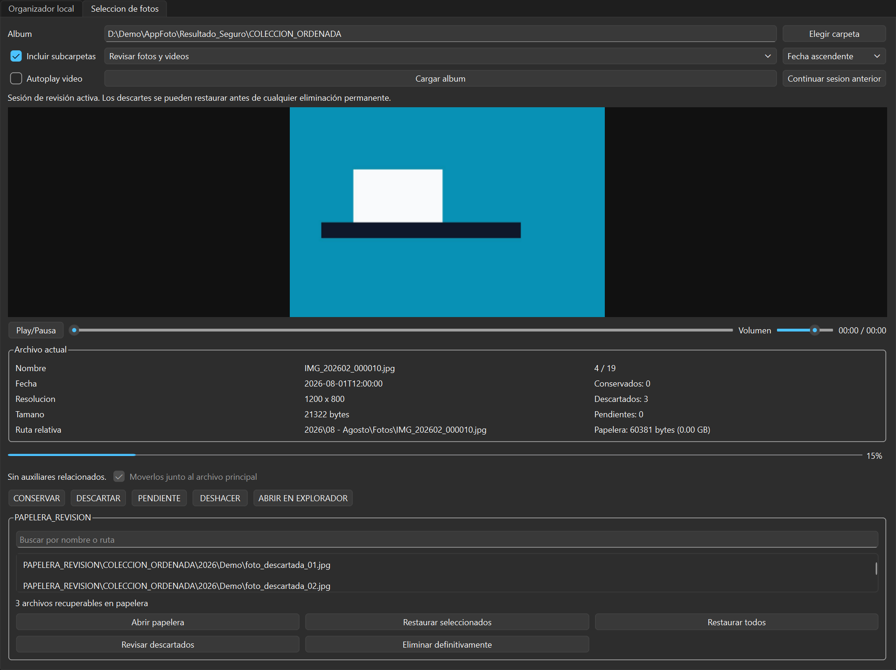

# App Foto

Aplicación de escritorio para Windows que organiza bibliotecas de fotos y vídeos, separa duplicados exactos y comprueba cada copia antes de incorporarla al destino.



## El problema

Reunir archivos de varios móviles y discos suele producir duplicados, nombres repetidos, fechas incompletas y copias difíciles de comprobar. App Foto analiza primero la biblioteca, calcula el espacio necesario y muestra el plan antes de escribir en el destino. El flujo de organización no modifica la carpeta de origen.

## Qué hace

- Detecta duplicados exactos agrupando por tamaño y comparando SHA-256.
- Organiza fotos y vídeos por fecha y tipo. Usa metadatos cuando están disponibles y alternativas documentadas cuando no.
- Resuelve nombres repetidos sin sobrescribir archivos existentes.
- Escribe cada copia en un archivo temporal, verifica tamaño y SHA-256 y después la renombra al destino definitivo.
- Guarda el progreso en SQLite y permite recuperar una organización interrumpida tras revisar qué copias siguen siendo válidas.
- Ejecuta una verificación final independiente que vuelve a leer origen y destino.
- Genera informes CSV, JSON y logs técnicos.
- Incluye una revisión manual separada con papelera recuperable y confirmaciones para el borrado definitivo.

## Tecnologías

- Python 3.11 o posterior.
- PySide6 para la interfaz de escritorio y workers `QThread`.
- SQLite, mediante la biblioteca estándar de Python, para estado y recuperación.
- SHA-256 mediante `hashlib` para detectar duplicados y verificar copias.
- ExifTool opcional para ampliar la lectura de metadatos.
- `unittest` para las pruebas automatizadas.

## Instalación

En Windows, abre PowerShell en la raíz del repositorio:

```powershell
python -m venv .venv
.\.venv\Scripts\Activate.ps1
python -m pip install --upgrade pip
python -m pip install -r requirements.txt
python -m pip check
```

`requirements.txt` instala el proyecto y toma sus dependencias de `pyproject.toml`. La instalación limpia se verificó con Python 3.14.6 y PySide6 6.11.2. La aplicación declara compatibilidad desde Python 3.11.

## Ejecución

Con el entorno virtual activado:

```powershell
app-foto
```

También puede iniciarse directamente desde el repositorio:

```powershell
python main.py
```

ExifTool no es necesario para arrancar. Si está disponible en `PATH` o junto al ejecutable, la aplicación lo utiliza para obtener metadatos adicionales; en caso contrario recurre a fechas de nombres de archivo o del sistema de archivos.

## Pruebas

Las pruebas crean sus archivos en directorios temporales y no necesitan una biblioteca personal:

```powershell
python -B -m unittest discover -s tests -v
```

Estado verificado el 12/09/2026: **37 de 37 pruebas superadas**.

La demostración integral genera archivos sintéticos, analiza duplicados, realiza las copias y confirma que el origen permanece intacto:

```powershell
python -B scripts\run_integral_demo.py
```

Para comprobar únicamente que la interfaz instalada puede crearse sin una pantalla física:

```powershell
python -I -B scripts\smoke_test_ui.py
```

## Construir el wheel

El wheel instalable se genera con las herramientas de empaquetado declaradas en `pyproject.toml`:

```powershell
python -m pip wheel --no-deps --wheel-dir dist .
```

El 12/09/2026 se construyó correctamente `app_foto-0.1.0-py3-none-any.whl` desde un entorno virtual nuevo. `dist/`, `build/` y `*.egg-info/` están excluidos del repositorio.

El script opcional `scripts\build_exe.ps1` instala el extra `build` y genera una distribución de PyInstaller. Ese ejecutable no forma parte del repositorio y todavía debe validarse en otro equipo Windows antes de distribuirlo.

## Arquitectura

- `photo_organizer/ui/` y `workers.py`: interfaz y tareas en segundo plano.
- `scanner.py`, `metadata.py`, `hashing.py` y `duplicate_detector.py`: análisis, fechas y duplicados.
- `planner.py`, `safe_copy.py`, `resume.py` y `organizer.py`: planificación, copia verificada y recuperación.
- `database.py`, `reports.py` y `final_verification.py`: persistencia, trazabilidad y comprobación final.
- `selection_review.py`: revisión manual, restauración y papelera.

## Capturas con datos ficticios

Las capturas se generan con `scripts\capture_demo_screenshots.py`. Utilizan imágenes geométricas sintéticas, rutas `D:\Demo\...`, fechas fijas y valores de capacidad ficticios.

### Selección de carpetas y opciones



### Verificación final



### Revisión recuperable



## Limitaciones

- Reduce riesgos mediante temporales, hashes y recuperación, pero no garantiza riesgo cero ni sustituye una copia de seguridad.
- La verificación no protege frente a todos los fallos posibles del hardware, cortes de alimentación o cambios concurrentes en el origen.
- La cobertura automatizada se centra en operaciones de archivos, recuperación, verificación y creación básica de la interfaz. No cubre todas las cámaras, formatos RAW/HEIC, bibliotecas de gran tamaño ni sistemas de archivos.
- La lectura avanzada de metadatos depende de ExifTool. La validación multimedia profunda de vídeo depende de FFmpeg/FFprobe.
- La revisión manual sí puede mover archivos a su papelera y eliminarlos permanentemente después de varias confirmaciones; es un flujo distinto de la organización por copia.
- La interfaz y algunos servicios concentran bastante código y pueden dividirse en componentes más pequeños.
- El comportamiento actual se ha verificado en Windows. No se ofrece soporte comprobado para macOS o Linux.

## Seguridad de los datos

El repositorio no incluye bibliotecas multimedia, bases SQLite, informes, logs, rutas personales ni historial Git anterior. Aun así, antes de borrar una carpeta de origen, conserva un backup independiente y revisa el informe final generado por la aplicación.
